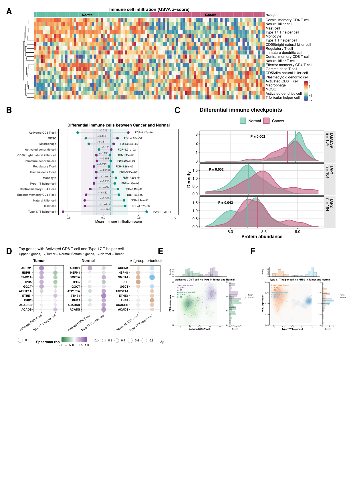

[中文](#中文) | [English](#english)

---

# panelpack

<a name="中文"></a>

> 一行命令，将子图拼成发表级组合图。

**panelpack** 是一个命令行工具，能自动识别文件夹中的子图文件（PDF / PNG / JPG / TIFF 等），按面板标签排序，合并为带有 **A, B, C...** 标注的组合图 PDF。

<p align="center">
  
</p>
<p align="center"><i>6 个子图自动拼合为一张组合图（布局 1,2,3，第三行比例 5:3:3）</i></p>

---

## 核心特性

- **自动识别** — 支持 `Fig3A.pdf`、`Figure A.png`、`B_plot.jpg`、`C.tiff` 等多种命名，放在同一文件夹即可
- **多格式混用** — PDF（矢量无损）、PNG、JPG、TIFF、BMP、GIF、WebP
- **灵活布局** — `--layout "1,2,3;()()(5:3:3)"` 一个参数搞定行列与宽度比例
- **中文标点兼容** — `（1：1：2）` 和 `(1:1:2)` 均可
- **尺寸计算器** — `--sizes` 输出 R/ggplot2 的 ggsave 推荐尺寸，确保文字不缩放

## 安装

```bash
# 从 GitHub 安装
pip install git+https://github.com/AHMUJia/panelpack.git

# 或者本地安装
git clone https://github.com/AHMUJia/panelpack.git
cd panelpack
pip install -e .
```

依赖：Python >= 3.9，[PyMuPDF](https://pymupdf.readthedocs.io/)

## 快速上手

```bash
# 自动识别当前目录的子图并组合
panelpack

# 指定布局：第1行1张，第2行2张，第3行3张
panelpack --layout 1,2,3

# 布局 + 宽度比例一体化写法
panelpack --layout "3,2;(1:1:2)(1:1)"

# 预览布局，不生成文件
panelpack --dry-run -v
```

## 支持的文件格式

| 格式 | 扩展名 |
|------|--------|
| PDF | `.pdf`（矢量无损嵌入） |
| PNG | `.png` |
| JPEG | `.jpg` `.jpeg` |
| TIFF | `.tiff` `.tif` |
| BMP / GIF / WebP | `.bmp` `.gif` `.webp` |

## 文件命名规范

同一文件夹中所有被识别的文件自动归为 **一张图** 的面板。支持以下命名（可混用）：

| 命名方式 | 示例 |
|----------|------|
| 带图号 | `Fig3A_volcano.pdf`、`Figure 3B.png`、`Fig.3C_plot.jpg` |
| 无图号 | `Fig A.pdf`、`Fig.B_plot.png`、`Figure C.tiff` |
| 纯字母 | `A. description.pdf`、`B_barplot.png`、`C.jpg`、`D.pdf` |

## 布局语法

```bash
# 基础布局（每行等宽）
panelpack --layout 2,2            # 2行，每行2张
panelpack --layout 1,2,3          # 3行：1+2+3张

# 带宽度比例（括号内写比例）
panelpack --layout "3,2;(1:1:2)(1:1)"
panelpack --layout "1,2,3;()()(5:3:3)"   # 空括号 = 等宽

# 中文标点也行
panelpack --layout "3,2;（1：1：2）（1：1）"
```

```
布局示意：--layout "1,2,3;()()(5:3:3)"

Row 1:  [       A (全宽)        ]
Row 2:  [    B    ] [    C    ]
Row 3:  [ D (5) ] [ E (3) ] [ F (3) ]
```

## R/ggplot2 推荐导出尺寸

运行 `panelpack --sizes` 查看各行面板数对应的导出尺寸，确保合并后文字不缩放：

```
$ panelpack --sizes

  每行面板数       宽度        高度   R ggsave()
  ----------  ---------- ---------- ----------------------
  1               197 mm     148 mm width=7.8, height=5.8
  2                98 mm      73 mm width=3.8, height=2.9
  3                64 mm      48 mm width=2.5, height=1.9
  4                48 mm      36 mm width=1.9, height=1.4
```

```r
# R 中按推荐尺寸导出，合并后 7pt 字体保持 7pt
ggsave("Fig1A.pdf", plot_a, width = 7.8, height = 5.8)  # 一行1张
ggsave("Fig1B.pdf", plot_b, width = 3.8, height = 2.9)  # 一行2张
ggsave("Fig1D.pdf", plot_d, width = 2.5, height = 1.9)  # 一行3张
```

## 更多示例

<p align="center">
  
</p>
<p align="center"><i>5 个混合格式子图（PDF + JPG + PNG），布局 2,1,2</i></p>

---

<a name="english"></a>

# English

> One command to compose sub-figures into publication-ready composite figures.

**panelpack** is a CLI tool that auto-detects sub-figure files (PDF, PNG, JPG, TIFF, ...) in a folder, sorts them by panel label, and merges them into a single PDF with bold **A, B, C...** labels.

## Features

- **Auto-detection** — recognizes `Fig3A.pdf`, `Figure A.png`, `B_plot.jpg`, `C.tiff`, and many more naming patterns
- **Multi-format** — PDF (vector, lossless), PNG, JPG, TIFF, BMP, GIF, WebP in the same folder
- **Flexible layout** — `--layout "1,2,3;()()(5:3:3)"` — rows, columns, and width ratios in one flag
- **Chinese punctuation** — `（1：1：2）` works alongside `(1:1:2)`
- **Size calculator** — `--sizes` prints recommended R/ggplot2 `ggsave()` dimensions to preserve text size

## Installation

```bash
pip install git+https://github.com/AHMUJia/panelpack.git
```

Requires Python >= 3.9 and [PyMuPDF](https://pymupdf.readthedocs.io/).

## Quick start

```bash
panelpack                                       # auto-detect & compose
panelpack --layout 1,2,3                        # specify rows
panelpack --layout "3,2;(1:1:2)(1:1)"           # layout + inline ratios
panelpack --dry-run -v                           # preview only
panelpack --panels "A=plot.pdf,B=img.png"        # explicit mapping
```

## Supported formats

| Format | Extensions |
|--------|------------|
| PDF | `.pdf` (embedded as vector) |
| PNG | `.png` |
| JPEG | `.jpg`, `.jpeg` |
| TIFF | `.tiff`, `.tif` |
| BMP / GIF / WebP | `.bmp`, `.gif`, `.webp` |

## File naming convention

All recognized files in the same folder are treated as panels of **one** figure. Naming styles can be mixed freely.

| Style | Examples |
|-------|----------|
| With figure number | `Fig3A_volcano.pdf`, `Figure 3B.png`, `Fig.3C_plot.jpg` |
| Without number | `Fig A.pdf`, `Fig.B_plot.png`, `Figure C.tiff` |
| Bare label | `A. description.pdf`, `B_barplot.png`, `C.jpg`, `D.pdf` |

**Output naming**: uses the most common figure number found (e.g. `Figure3_combined.pdf`), or `Figure_combined.pdf` if none.

## Layout syntax

```bash
# Basic (equal width per row)
panelpack --layout 2,2
panelpack --layout 1,2,3

# With inline width ratios
panelpack --layout "3,2;(1:1:2)(1:1)"       # row 1 = 1:1:2, row 2 = equal
panelpack --layout "1,2,3;()()(5:3:3)"      # only row 3 has custom ratios
panelpack --layout "3,2(1:1:2)(1:1)"         # semicolon is optional
```

```
Visual: --layout "1,2,3;()()(5:3:3)"

Row 1:  [    A (full width)    ]
Row 2:  [   B   ] [   C   ]
Row 3:  [ D (5) ][ E (3)][ F (3)]
```

### Separate `--ratios` flag

```bash
panelpack --layout 1,2,3 --ratios "auto;auto;5:3:3"
panelpack --layout 2,2 --ratios "prop;prop"   # proportional to source widths
```

| Keyword | Meaning |
|---------|---------|
| `auto` or `()` | Equal width (default) |
| `prop` | Proportional to source image widths |
| `5:3:3` | Explicit ratio |

## Recommended export sizes

```bash
panelpack --sizes                         # A4 default
panelpack --sizes --page-size A3 --landscape
panelpack --sizes --page-size 180x240     # custom WxH in mm
```

```
$ panelpack --sizes

  Panels/row        Width     Height R ggsave()
  ----------  ---------- ---------- ----------------------
  1               197 mm     148 mm width=7.8, height=5.8
  2                98 mm      73 mm width=3.8, height=2.9
  3                64 mm      48 mm width=2.5, height=1.9
  4                48 mm      36 mm width=1.9, height=1.4
```

### R / ggplot2 example

```r
ggsave("Fig1A.pdf", plot_a, width = 7.8, height = 5.8)  # 1 per row
ggsave("Fig1B.pdf", plot_b, width = 3.8, height = 2.9)  # 2 per row
ggsave("Fig1D.pdf", plot_d, width = 2.5, height = 1.9)  # 3 per row
```

With these sizes, panelpack places each panel at **scale ~ 1.0** — a 7pt font in R stays 7pt in the final figure.

## Python API

```python
from panelpack import interactive_compose

interactive_compose("./Figure4", layout="1,2,3;()()(5:3:3)")
```

## CLI reference

| Option | Description |
|--------|-------------|
| `-d, --dir DIR` | Directory to scan (default: `.`) |
| `--layout SPEC` | Rows with optional ratios: `1,2,3` or `3,2;(1:1:2)(1:1)` |
| `--ratios SPEC` | Width ratios: `auto;auto;5:3:3`. Overrides inline. |
| `--row-heights SPEC` | Row height weights: `2:3:4` |
| `--page-size SIZE` | `A4`, `A3`, `letter`, or `WxH` in mm |
| `--landscape` | Landscape orientation |
| `--label-size PT` | Label font size (default: `14`) |
| `--margin PT` | Page margin (default: `10`) |
| `--gap PT` | Gap between panels (default: `6`) |
| `--no-labels` | Omit panel labels |
| `--figure N` | Override figure number for output naming |
| `--panels SPEC` | Explicit mapping: `A=file.pdf,B=img.png,...` |
| `--sizes` | Print recommended export sizes and exit |
| `--dry-run` | Preview layout without generating PDF |
| `--open` | Open output after generation |
| `-v, --verbose` | Verbose output |
| `-o, --output FILE` | Output filename |

## License

MIT
